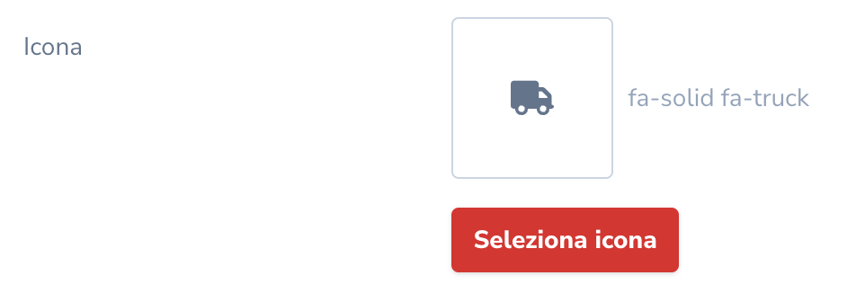
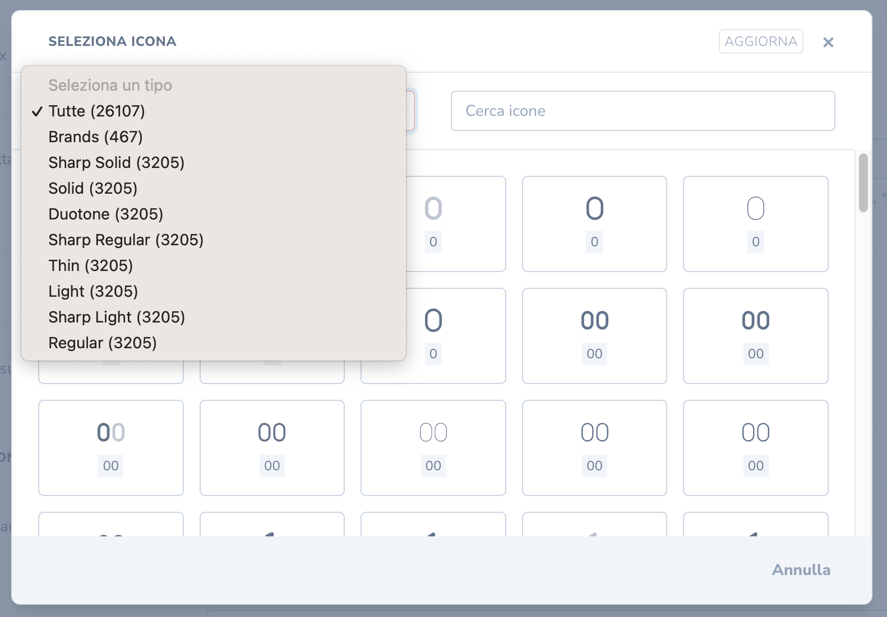
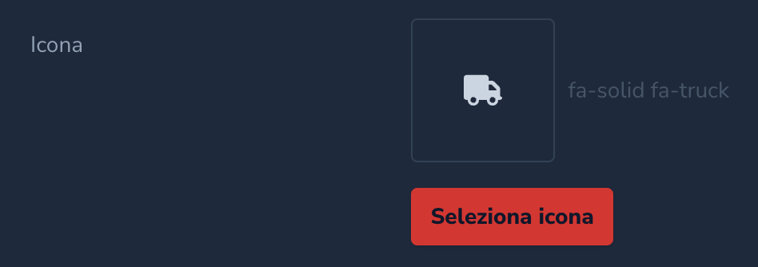
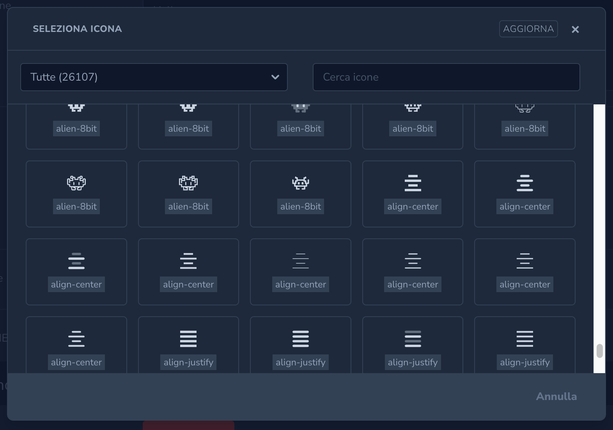

# Nova Icon Field

> A Laravel Nova 4 Field for svg icon selection.

---






This package allows you to create a svg icon set in your storage, and allow your users to select any icon from a field on Laravel Nova.

For example, you can use it to store FontAwesome icons (or similar, such as Heroicons, or even your own icons!) in svg format on your storage, and directly use the SVGs in your frontend to avoid bundling the entire icon set. This will be extremely more lightweight with respect to importing all the icons from a webfont file. 

## Installation:

You can install the package in to a Laravel app that uses Nova via composer:

```bash
composer require datomatic/nova-icon-field
```

Publish the translations to set the labels of the icon's styles:
```
php artisan vendor:publish --provider="Datomatic\NovaIconField\FieldServiceProvider" --tag="translations"
```

Publish the configuration file and edit it to your preference:
```
php artisan vendor:publish --provider="Datomatic\NovaIconField\FieldServiceProvider" --tag="config"
```

In particular, you have to set a storage disk in which all the icons are stored. You can create one in your `config/filesystems.php`, for example:
```php
    'nova-icon-field' => [
        'driver' => 'local',
        'root' => storage_path('icons'),
        'throw' => false,
    ],
```

The expected directory structure has directories on the root defining the available styles and in each directory the icons in svg format for that specific style. For example:
```
    fontawesome-solid/
        abacus.svg
        album.svg
        angel.svg
        ...
        
    heroicons/
        arrow-down.svg
        arrow-up.svg
        bars.svg
        ...
    
    ...
```

The storage will be explored just once, and the results will be cached in your Laravel cache. If you make some changes on the files (e.g., add/remove an icon or a directory), you have to press the "update" button on the icon picker to see the changes.

Styles and icons will be considered depending on the folder and file names (without extension), transformed in kebab-case. So if your icon file is named `Your Beautiful Icon.svg`, the icon name will be `your-beautiful-icon`.

## Usage:

Add the field in your Nova resources fields:

```php
  use Datomatic\NovaIconField\NovaIconField;

  NovaIconField::make('Icon')
```

You can override the text for the field button like so:

```php
  NovaIconField::make('Icon')
    ->addButtonText('Click me!')
```

You can set a default icon for when an icon has not been set like so. First parameter is the style and the second is the icon name:

```php
  NovaIconField::make('Icon')
    ->defaultIcon('solid', 'check-circle')
```

If you want to persist the default icon (when they press clear it brings back the default, so it can't be empty) then add the following:

```php
  NovaIconField::make('Icon')
    ->defaultIcon('solid', 'check-circle')
    ->persistDefaultIcon()
```

You can limit the icons the user can choose from like so:

```php
  NovaIconField::make('Icon')->only([
    'solid', // enables all the icons with style `solid` or name `solid`
    
    ['style' => 'solid'], // enable all the icons with style `solid`
    ['icon' => 'arrow-up'], // enable all the icons with name `arrow-up`
    
    'solid arrow-down', // enables the icon with style `solid` and name `arrow-down`
    ['style' => 'solid', 'icon' => 'arrow-down'], // enables the icon with style `solid` and name `arrow-down`
  ])
```

The selected icon will be stored in database as a string composed by the selected style in kebab-case and the selected icon in kebab-case separated by a space (e.g, `solid arrow-up`).

You can choose to add a prefix or a suffix applied to the style and/or to the icon stored in the database by changing the config. 

For example, by setting:
```php
// config/nova-icon-field.php
return [
    // ...
    'style_prefix' => 'fa-',
    'icon_prefix' => 'fa-',
    // ...
];
```
The stored icon will be saved as `fa-solid fa-arrow-up` (which can be directly used as a FontAwesome class name). 

In your code (i.e., while setting `only([...])` or `defaultIcon(...)`), you'll always be referring the icons and styles without any prefix/suffix. The prefixes/suffixes are just used in visualization and on (de-)hydration from (to) db.

### Security

If needed, from the config file you can set which middlewares are going to be used to secure the endpoints used by this library (to obtain styles, icon list, purge the cache and obtaining the SVGs). 

The routes used only on nova (to obtain styles, icon list and purge the cache) and the route used to obtain the SVG of a given icon are treated separately (so that you can use it also from your frontend).

You can also choose to set additional headers (for the nova requests) or query params (for the icon's svg request) to the requests.

One possible approach is to set a middleware which verifies the presence of a secret token on the header of the request.

If you want to set a rate limiter on the svg requests, remember that you have to skip the throttling when requesting the icons from the icon picker (since lots of icons will be loaded from there). 
To achieve that, you can, for example, create a custom middleware which, depending on the presence of a query parameter with a secret token, disables/enables the rate limiter.

### Visualize selected icons on the frontend

The selected icon will be stored in database as a string composed by the selected style in kebab-case and the selected icon in kebab-case separated by a space, together with (if set in the config) additional prefixes and suffixes (e.g, `solid arrow-up`).

In your frontend, you can obtain the SVG by using the endpoint:
```
http(s)://{host}/nova-icon-field/{style}/{icon}
```
You can change the `nova-icon-field` part of the url from the config. `{style}` and `{icon}` should be provided without prefixes/suffixes.

To visualize the svg there are several alternatives: you can insert it via a `` tag, an `<iframe>` tag, or also by using some framework-specific libraries such as:
- Vue: [vue-inline-svg](https://www.npmjs.com/package/vue-inline-svg)
- React: [react-svg](https://www.npmjs.com/package/react-svg)

There are also many other ways. You should find by yourself which solution is more suited for your needs and your framework.

## License:

The MIT License (MIT). Please see [License File](LICENSE) for more information.
